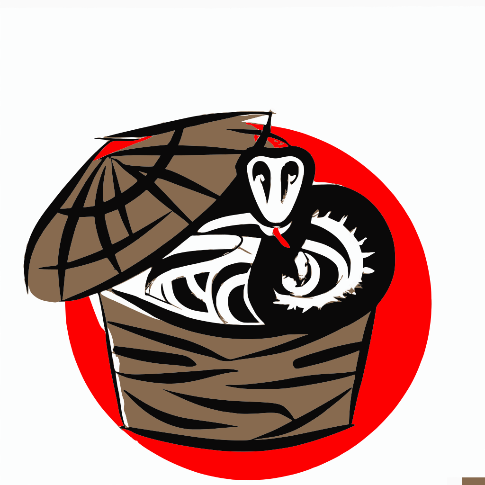

<div align="center">
  

  <h1>SnaB - Snake Basket</h1>

  <p>
    <a href="https://github.com/msiebeneicher/snab/actions/workflows/pre-commit.yml">
      
    </a>
  </p>

  <p>
    SnaB is a shell runner, inspired by  <a href="https://taskfile.dev/">taks</a> and aims to enable you to bundle shell script and commands like a powerful modern CLI applications with the help of <a href="https://cobra.dev/">Cobra</a>
  </p>
  <hr />
</div>

**Content:**
- [Features](#features)
- [Installation](#installation)
  - [Get The Binary](#get-the-binary)
- [Usage](#usage)
  - [Getting started](#getting-started)
  - [Snabfile](#snabfile)
  - [Command directory](#command-directory)
  - [Flags](#flags)
  - [Forwarding CLI arguments to commands](#forwarding-cli-arguments-to-commands)
- [API Reference](#api-reference)
  - [CLI](#cli)
    - [SnaB Commands](#snab-commands)
    - [Global Flags](#global-flags)
    - [ENV](#env)
  - [Schema](#schema)
    - [Snabfile](#snabfile-1)
    - [Description](#description)
    - [Task](#task)
    - [Flag](#flag)

## Features

- Easy installation: just download a single binary, add to $PATH and you're done!
- Simulate own application binary: install and uninstall a starting script of your bundle with simple commands
- Tab completion: Usable tab autocompletion for your bundle
- Generate docs: generate automatically docs for your bundle with a simple command

## Installation

### Get The Binary

You can download the binary from the [releases page](https://github.com/msiebeneicher/snab/releases) on GitHub and add to your $PATH.

The task_checksums.txt file contains the SHA-256 checksum for each file.

## Usage

### Getting started

Create a file called `.snab.yml` in the root of your project. The cmds attribute should contain the commands of a task. Each task reflects and command your final cli app. The example below allows provide a command `foo` which will execute the `foo.sh` script in the same directory.

```yaml
schema_version: '0.1'

name: boa
version: '1.0.0'

description:
  short: 'Boa Example - SnaB - bundle shell script to a powerful modern CLI applications'
  long: 'Boa Example - SnaB - enable you to bundle shell script to a powerful modern CLI applications'
  example: boa /foo/bar/example

tasks:
  foo:
    description:
      short: 'foo script'
      long: 'execute awesome foo script'
      example: 'boa foo [--verbose] PATH'
    cmds:
      - ./foo.sh
```

Running the command is as simple as running:

```sh
snab foo --help
```

### Snabfile

By default SnaB will search for a `.snab.yml` snabfile in the current working directory.
You can set also set a path to your snabfile globally by using the `--snabfile ./path/to/.snab.yml` or by the env var `SNABFILE`.

### Command directory

By default, commands will be executed in the directory where the Snabfile is located. But you can easily make the command run in another folder, informing dir:

```yaml
schema_version: '0.1'

# [...]

tasks:
  foo:
    dir: foobar
    cmds:
      - ./bar.sh
```

### Flags

You are able to define flags for your commands which is important for generating the help and docs.
The defined flags can be used in your commands by [Go's template engine](https://golang.org/pkg/text/template/) and are available under the defined name of the flag.

You can choose between `string` and `boolean` flags.

```yaml
schema_version: '0.1'

# [...]

tasks:
  bar:
    flags:
      - name: optionA
        shorthand: o
        usage: My option to handle something
        value: default-bar-value
        type: string
      - name: optionB
        usage: Second option without default value
      - name: optionC
        usage: Boolean option to handle something
        value: false
        type: bool
    cmds:
      - ./bar.sh --optionA="{{ .optionA }}"
      - ./bar.sh --optionA="{{ .optionA }}"{{ if .optionB }} --optionB="{{ .optionB }}"{{ end }}
      - ./bar.sh --optionA="{{ .optionA }}"{{ if .optionC }} --isOptionC{{ end }}
```

### Forwarding CLI arguments to commands

By default all arguments will forward to the commands of your task.

The snab command `snab foo my-first-argument my-second-argument` from the example will execute `./foo.sh my-first-argument my-second-argument` under the hood.

## API Reference

### CLI

SnaB command line tool has the following syntax:

```sh
snab [--flags] [commands...] [CLI_ARGS...]
```

If you installed you bundle you can execute your app by the defined name in your snabfile:

```yaml
schema_version: '0.1'

name: boa

# [...]
```

```sh
boa [--flags] [commands...] [CLI_ARGS...]
```

#### SnaB Commands

SnaB provide some default subcommands: `<snap|app> snab --help`

| Command       | Description                                 |
| ------------- | ------------------------------------------- |
| docs generate | Generate markdown docs                      |
| install       | Install snab basket under `/usr/local/bin`  |
| uninstall     | Uninstall snab basket from `/usr/local/bin` |

#### Global Flags

| Short | Flag       | Type   | Default     | Description                       |
| ----- | ---------- | -------| ----------- | --------------------------------- |
|       | --snabfile | string | working dir | Path to your snabfile (hidden)    |
|       | --trace    | bool   | false       | set verbose output to trace level |
| -v    | --verbose  | bool   | false       | set verbose output to debug level |

#### ENV

| ENV      | Default | Description           |
| -------- | ------- | --------------------- |
| SNABFILE |         | Path to your snabfile |

### Schema

#### Snabfile

| Attribute      | Type                        | Default | Description |
| -------------- | ----------------------------| ------- | ----------- |
| schema_version | string                      | 0.1     | Version of the snabfile. The current version is `0.1` |
| name           | string                      |         | Name ouf your snab bundle |
| version        | string                      |         | Version ouf your snab bundle |
| description    | [Description](#description) |         | Description struct |
| tasks          | [map[string]Task](#task)    |         | A set of tasks. The key also reflects the final command name. |

#### Description

| Attribute | Type   | Default | Description |
| --------- | ------ | ------- | ----------- |
| short     | string |         | Short description shown in the 'help' output |
| long      | string |         | Short message shown in the 'help this-command' output |
| example   | string |         | Example of how to use the command |

#### Task

| Attribute   | Type                        | Default                     | Description |
| ----------- | --------------------------- | --------------------------- | ----------- |
| description | [Description](#description) |                             | Description struct |
| dir         | string                      | _current working directory_ | The directory in which this command should run |
| flags       | [[]Flag](#flag)             |                             | Array of Flag structs |
| cmds        | []string                    |                             | Array of commands to be execute |

#### Flag

| Attribute | Type   | Default | Description |
| --------- | ------ | ------- | ----------- |
| name      | string |         | Name of the flag. Used in 'help' output and can be used as go-template var in cmds strings. |
| shorthand | string |         | Shorthand letter that can be used after a single dash |
| usage     | string |         | Usage string used in 'help' output |
| value     | string |         | Default value of the flag |
| type      | string | string  | Type of the Flag value. Possible are the "bool" and "string" |
